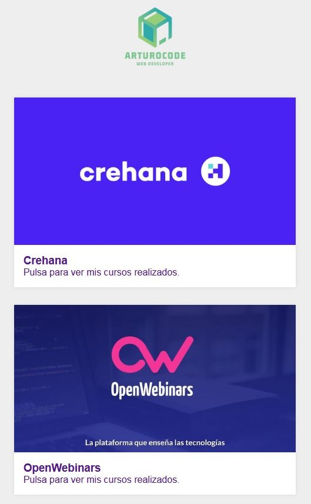

# ArturoCode - Galería de Cursos

Es un portfolio al estilo de una galería de imágenes con pequeñas animaciones para acceder a los cursos de informática que he realizado y tenga un uso útil, además de ser un ejemplo de página de este estilo. Están clasificadas por el sitio en el que he realizado los cursos y dentro de ellos hay subgalerías donde al pulsar encontrareis mi diploma de dicho curso seleccionado.

Es una página sencilla realizada con HTML y CSS, principalmente. Es responsive y a diferencia de mi <a href="https://arturocode.github.io/">portfolio web</a>, no tiene un modo claro/oscuro.

<table>
    <tr>
        <td></td>
        <td></td>
    </tr>
</table>
