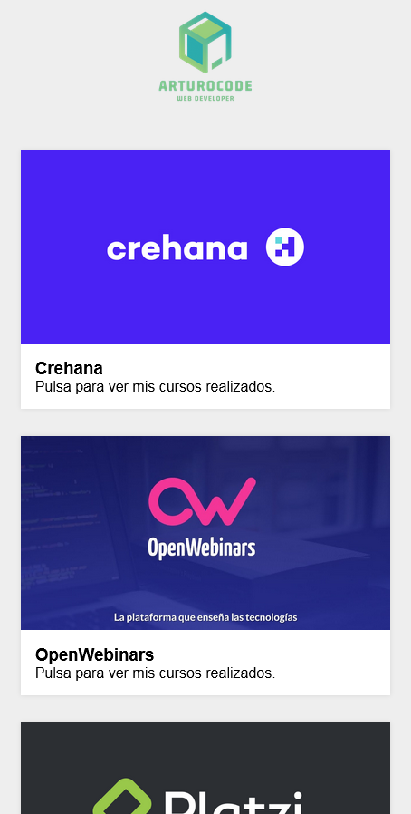

# Galería de Cursos | ArturoCode

Es un portfolio al estilo de una galería de imágenes con pequeñas animaciones para acceder a los cursos de informática que he realizado y tenga un uso útil. El sistema está clasificado por la plataforma en la que he realizado los cursos y dentro de cada una de ellas hay subgalerías donde al pulsar se accede al diploma del curso seleccionado.

Es una página sencilla realizada con HTML y CSS, principalmente, y es responsive.

<table>
    <tr>
        <td></td>
        <td></td>
    </tr>
</table>
